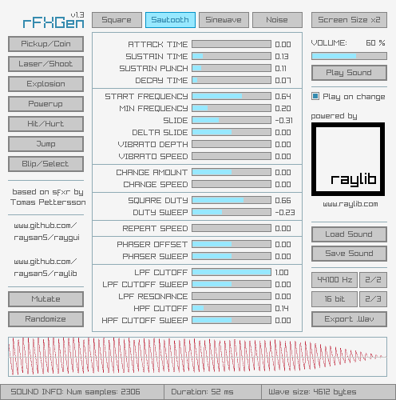

# rFXGen
A simple and easy-to-use fx sounds generator, based on the amazing [Dr.Petter's sfxr](http://www.drpetter.se/project_sfxr.html).
Generate sounds procedurally for your games!

 
 
 
 

## Features

 - Multiple wave types supported (Square, Sawtooth, Sine, Noise)
 - Predefined sound presets (Coin, Shoot, Explosion, PowerUp...)
 - **Load .rfx** sounds and import **.sfs** files (compatible with sfxr)
 - **Save .rfx** sounds with generation parameters (**only 104 bytes!**)
 - **Export .wav** files, configurable sample-rate and bits-per-sample
 - **Powerful command line** for batch conversion and wave playing
 - Wave data visualization in real-time
 - **Completely portable (single file)**
 - **Free and open source**
 
## Screenshots

## License

rFXGen is **free and open source software**. rFXGen source code is licensed under an unmodified [zlib/libpng license](LICENSE].

Despite being completely free, [consider a small donation](https://www.paypal.com/donate/?token=Oo3h2bHS9ux4lNzahXhmH3oaAqQpBeeMy2zNoH1lxHuD5Vdi1-B6XlPRlEyEzLmBb7rGwG) for the development efforts or [contributing to raylib patreon](https://www.patreon.com/raylib) to help the author keep working on free software for games development.

*Copyright (c) 2016-2018 Ramon Santamaria ([@raysan5](https://twitter.com/raysan5))*
