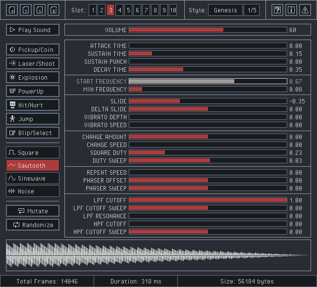

# `rFXGen`

A simple and easy-to-use fx sounds generator, based on the amazing [Dr.Petter's sfxr](http://www.drpetter.se/project_sfxr.html).

## What can I do with `rFXGen`?

Generate chiptune style sounds for your games or applications, adjusting fx parameters with maximum control!

`rFXGen` can be used for free as a [WebAssembly online tool](https://raylibtech.itch.io/rfxgen) and it can also be downloaded as a **standalone tool** for for seeveral platforms.

## Features

 - Predefined **sound presets** (Coin, Shoot, Explosion, PowerUp...)
 - Multiple wave types supported (Square, Sawtooth, Sine, Noise)
 - Up to **10 sound slots** to store generated sound (temporary save)
 - Load `.rfx` files with sound generation parameters
 - Save `.rfx` files with sound generation parameters (**104 bytes only**)
 - Export wave data as `.wav`, `.raw` data or `.h` code file (byte array)
 - Configurable sample-rate, bits-per-sample and channels on export
 - Multiple GUI styles with support for custom ones (`.rgs`)
 - Command-line support for `.rfx` to `.wav` batch conversion
 - Command-line support to generate audio files based on presets
 - Command-line audio player for `.wav`, `.ogg`, `.mp3` and `.flac`
 - **Completely portable (single-file, no-dependencies)**
 - **Free and open-source**

## Screenshot


 
## Basic Usage

Open the tools and use the buttons to generate random sounds. Use the sliders to customize sound parameters.
Sounds could be saved as `.rfx` (sound generation parameters) and also exported to `.wav`, `.raw` (samples data) and `.h` (byte array code file). 

`rFXGen Standalone` comes with command-line support for batch conversion and audio playing. For usage help:

 > rfxgen.exe --help

### Command-line

`rFXGen` desktop version comes with command-line support for batch sound generation and cli sounds playing. For usage help:

 > rfxgen.exe --help

```
USAGE:
    > rfxgen [--help] --input <filename.ext> [--output <filename.ext>]
             [--format <sample_rate>,<sample_size>,<channels>] [--play <filename.ext>]

OPTIONS:
    -h, --help                      : Show tool version and command line usage help
    -i, --input <filename.ext>      : Define input file.
                                      Supported extensions: .rfx, .wav, .qoa, .ogg, .flac, .mp3\n
    -o, --output <filename.ext>     : Define output file.
                                      Supported extensions: .wav, .qoa, .raw, .h
                                      NOTE: If not specified, defaults to: output.wav\n
    -g, --generate <preset>            : Generate file based on the preset.
                                      Supported presets: coin, laser, explosion, powerup, hit, jump, blip
    -f, --format <sample_rate>,<sample_size>,<channels>
                                    : Define output wave format. Comma separated values.
                                      Supported values:
                                          Sample rate:      22050, 44100
                                          Sample size:      8, 16, 32
                                          Channels:         1 (mono), 2 (stereo)
                                      NOTE: If not specified, defaults to: 44100, 16, 1
    -p, --play <filename.ext>       : Play provided sound.
                                      Supported extensions: .wav, .qoa, .ogg, .flac, .mp3
```

## Technologies

This tool has been created using the following open-source technologies:

 - [raylib](https://github.com/raysan5/raylib) - A simple and easy-to-use library to enjoy videogames programming
 - [raygui](https://github.com/raysan5/raygui) - A simple and easy-to-use immediate-mode-gui library
 - [tinyfiledialogs](https://sourceforge.net/projects/tinyfiledialogs/) - File dialogs for desktop platforms

## Handmade Software

`rFXGen` is handmade software, it has been meticulously developed using the C programming language, with great attention put on each line of code written.
This approach usually results in highly optimized and efficient code, but it is also more time-consuming and require a higher level of technical skills.
The result is great performance and small memory footprint.

`rFXGen` is self-contained in a single-executable of about **1.5 MB**, it could fit on a floppy disk.

## Issues & Feedback

Note that the free version of `rFXGen` comes with no support. Still, tool issues and feedback can be reported at https://github.com/raysan5/rfxgen. They are reviewed with low-priority.

For additional support, priority issues review or tool customization requirements, please contact `ray[at]raylibtech.com`

## License

`rFXGen` source code is distributed as **open source**, licensed under an unmodified [zlib/libpng license](LICENSE). 

`rFXGen` binaries are completely free for anyone willing to compile it directly from sources.

In any case, consider some donation to help the author keep working on useful software development.

*Copyright (c) 2015-2026 raylib technologies ([@raylibtech](https://github.com/raylibtech)) / Ramon Santamaria ([@raysan5](https://github.com/raysan5))*
