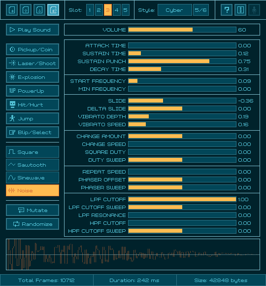

# rFXGen

 

A simple and easy-to-use fx sounds generator, based on the amazing [Dr.Petter's sfxr](http://www.drpetter.se/project_sfxr.html).

 

`rFXGen` can be used for free as a [WebAssembly online tool](https://raylibtech.itch.io/rfxgen) and it can also be downloaded as a **standalone tool** for _Windows_ and _Linux_ with some extra features. Binaries for other OSs are not released but they can be compiled from sources.

 

## rFXGen Features

 - Predefined **sound presets** (Coin, Shoot, Explosion, PowerUp...)
 - Multiple wave types supported (Square, Sawtooth, Sine, Noise)
 - Up to **5 sound slots** to store generated sound (temporary save)
 - Load `.rfx` files with sound generation parameters
 - Save `.rfx` files with sound generation parameters (**104 bytes only**)
 - Export wave data as `.wav`, `.raw` data or `.h` code file (byte array)
 - Configurable sample-rate, bits-per-sample and channels on export
 - Multiple GUI styles with support for custom ones (`.rgs`)
 - **Completely free and open-source**
 
### rFXGen Standalone Additional Features

 - Command-line support for `.rfx` to `.wav` batch conversion
 - Command-line audio player for `.wav`, `.ogg`, `.mp3` and `.flac`
 - **Completely portable (single-file, no-dependencies)**

## rFXGen Screenshot

 
## rFXGen Usage

Open the tools and use the buttons to generate random sounds. Use the sliders to customize sound parameters.
Sounds could be saved as `.rfx` (sound generation parameters) and also exported to `.wav`, `.raw` (samples data) and `.h` (byte array code file). 

`rFXGen Standalone` comes with command-line support for batch conversion and audio playing. For usage help:

 > rfxgen.exe --help

## rFXGen License

`rFXGen` source code is distributed as **open source**, licensed under an unmodified [zlib/libpng license](LICENSE). 

`rFXGen` binaries are completely free for anyone willing to compile it directly from source.

`rFXGen Standalone` desktop tool is distributed as freeware. 

In any case, consider some donation to help the author keep working on software for games development.

*Copyright (c) 2015-2024 raylib technologies ([@raylibtech](https://twitter.com/raylibtech)) / Ramon Santamaria ([@raysan5](https://twitter.com/raysan5))*
