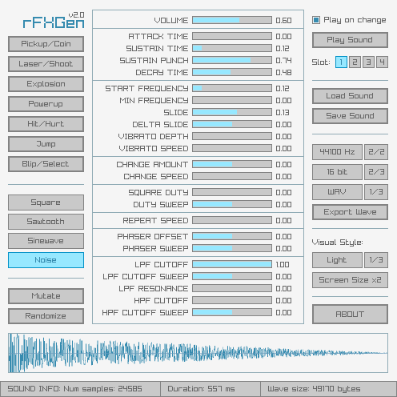

# rFXGen
A simple and easy-to-use fx sounds generator, based on the amazing [Dr.Petter's sfxr](http://www.drpetter.se/project_sfxr.html).

`rFXGen` can be used for free [here](https://raylibtech.itch.io/rfxgen) (WebAssembly online version). It can also be downloaded as a standalone tool for _Windows_ and _Linux_ with some extra features. It can also be compiled for other OSs if desired.

 

## rFXGen Features

 - Predefined **sound presets** (Coin, Shoot, Explosion, PowerUp...)
 - Multiple wave types supported (Square, Sawtooth, Sine, Noise)
 - Up to **4 save slots** to store generate sound (temporary save)
 - Load `.rfx` sounds or import `.sfs` files (compatible with sfxr)
 - Save `.rfx` sounds with generation parameters (**104 bytes only**)
 - Export generated waves with configurable sample-rate and bits-per-sample
 - Export to `.wav`, `.raw` data or `.h` code file (byte array)
 - Four unique GUI styles: **Light**, **Jungle**, **Candy** and **Lavanda**
 
### rFXGen Standalone Additional Features

 - Command-line support for `.rfx`/`.sfs` to `.wav` batch conversion
 - Command-line audio player for `.wav`, `.ogg`, `.mp3` and `.flac`
 - **Completely portable (single-file, no-dependencies)**

## rFXGen Screenshot

 
## rFXGen Usage

Open the tools and use the buttons to generate random sounds. Use the sliders to customize sound parameters.
Sounds could be saved as `.rfx` (sound generation parameters) and also exported to `.wav`, `.raw` (samples data) and `.h` (byte array code file). 

`rFXGen Standalone` comes with command-line support for batch conversion and audio playing. For usage help:

 > rfxgen.exe --help

## rFXGen License

`rFXGen` source code is distributed as **open source**, licensed under an unmodified [zlib/libpng license](LICENSE). `rFXGen` binaries are completely free for anyone willing to compile it directly from source.

`rFXGen Standalone` is distributed as a low-cost tool for download. In any case, consider it as a small donation to help the author keep working on software for games development.

*Copyright (c) 2015-2021 raylib technologies ([@raylibtech](https://twitter.com/raylibtech))*
